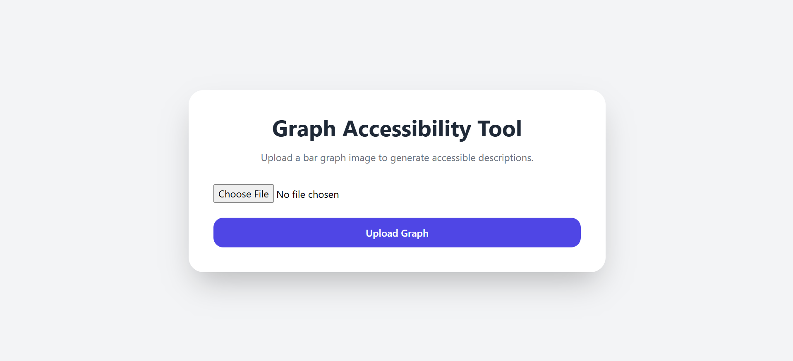
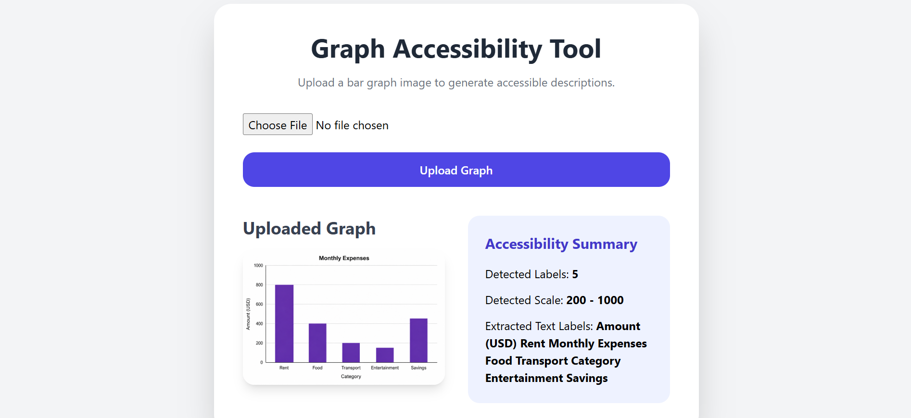

# OCR Accessibility Demo

A Django-based web application that demonstrates Optical Character Recognition (OCR) and image preprocessing techniques for extracting text from uploaded chart and graph images.

The project focuses on accessibility by extracting textual information from visual content and presenting it in a readable format.

---

## Features

- Upload chart or graph images
- OCR-based text extraction using Tesseract
- Image preprocessing using OpenCV
- Accessibility-focused text presentation
- Automatic detection and display of extracted labels
- Simple and responsive Django interface

---

## Technologies Used

- Python
- Django
- OpenCV
- Tesseract OCR
- HTML
- CSS
- Tailwind CSS

---

## How It Works

1. Upload a chart or graph image.
2. The image is preprocessed using OpenCV.
3. Tesseract OCR extracts textual content from the image.
4. Extracted text is displayed on the interface.
5. An accessibility summary presents detected labels and scale information.

---

## Project Structure

```text
ocr-accessibility-demo/

├── core/
├── graphs/
├── media/
├── screenshots/
│   ├── home.png
│   └── ocr_result.png
│
├── templates/
├── manage.py
├── requirements.txt
└── README.md
```

---

## Screenshots

### Home Page



### OCR Results



---

## Learning Objectives

This project demonstrates:

- Django file uploads
- Image handling in Django
- OCR integration with Tesseract
- Image preprocessing with OpenCV
- Accessibility-oriented application design
- Basic computer vision workflows

---

## Future Improvements

- Automatic chart title detection
- Improved OCR accuracy
- Bar detection and value extraction
- Enhanced accessibility descriptions
- Support for multiple chart types

---

## Author

**Muhammad Ubaid**

Master of Computer Science

LUMS
